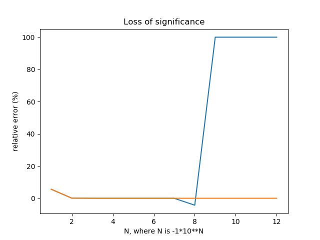

# MCOC-Proyecto-0
MCOC-Proyecto-0

Introducción
==============

Este ejemplo es el mostrado en el material extra del repositorio https://github.com/jaabell/MCOC-Proyecto-0.git, especificamente del video: https://www.youtube.com/watch?v=0MSaJwjYtmU. Material otorgado por el profesor.
Ejemplo:
==============

En este ejemplo se utilizan las fórmulas f(x) y g(x).
```
__f(x) = x*((4*(x**2) + 1)**0.5 + 2*x)__
__g(X) = x/((4*(x**2) + 1)**0.5 - 2*x)__
```
Dichas fórmulas son equivalentes, como se explica en el video, sin embargo no entregan los mismos resultados debidos a que el computador no puede soportar caracteres tan grandes.
En otras palabras, la función f pierde significancia a medida que esta tiende al infinito.


Resultados
==============

Se define el error relativo como 

	ERROR = (Promedio_Calculado - Resultado_Exacto) / Resultado_Exacto

Abajo se muestra como en la función f el error relativo va disminuyendo hasta llegar al punto en que salta a un error relativo del 100%; esto se debe a que al llegar a -1*10⁹ el computador no soporta los caracteres retornando 0, demostrandose una perdia de significancia importantisima, puesto que tras este limite el computador simplemente retorna cero.
Por el contrario, en la funcion g, se puede ver que el error va disminuyendo constantemente, lo que es muy bueno pero ocurre tambien en este caso que al ser el error relativo muy pequeño retorna cero de igual manera; por lo que termina perdiendo significancia en este caso. 


Output de la consola:
f(x):
```
	value: -0.2360679775 relative error: 5.57280900008%
	value: -0.249843945008 relative error: 0.06242199685%
	value: -0.249998437519 relative error: 0.000624992344456%
	value: -0.249999984362 relative error: 6.25514076091e-06%
	value: -0.250000011874 relative error: -4.74974513054e-06%
	value: -0.24999899324 relative error: 0.000402703881264%
	value: -0.250060111284 relative error: -0.0240445137024%
	value: -0.260770320892 relative error: -4.30812835693%
	value: -0.0 relative error: 100.0%
	value: -0.0 relative error: 100.0%
	value: -0.0 relative error: 100.0%
```
g(x):
```
	value: -0.2360679775 relative error: 5.57280900008%
	value: -0.249843945008 relative error: 0.0624219968571%
	value: -0.24999843752 relative error: 0.000624992187614%
	value: -0.249999984375 relative error: 6.24999922927e-06%
	value: -0.249999999844 relative error: 6.25000051713e-08%
	value: -0.249999999998 relative error: 6.25000051713e-10%
	value: -0.25 relative error: 6.25055562864e-12%
	value: -0.25 relative error: 7.77156117238e-14%
	value: -0.25 relative error: 0.0%
	value: -0.25 relative error: 0.0%
	value: -0.25 relative error: 0.0%
```

